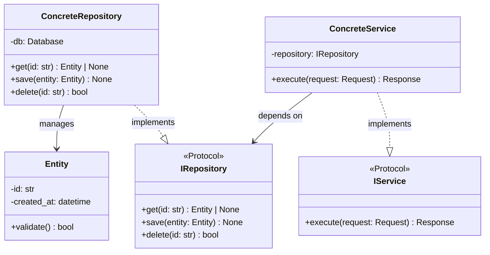

# Class Diagram: [Module Name]

## Overview

Brief description of the module and its purpose.

## Principles Applied

- [ ] **SRP**: Each class has single responsibility
- [ ] **OCP**: Extensible via new classes, not modification
- [ ] **LSP**: Subclasses substitutable for parents
- [ ] **ISP**: Small, focused interfaces (Protocols)
- [ ] **DIP**: Depend on abstractions (Protocols)

## Patterns Used

- [ ] Pattern: [reason for use]

## Diagram



## Type Hints

```python
from typing import Protocol

class IRepository(Protocol):
    def get(self, id: str) -> Entity | None: ...
    def save(self, entity: Entity) -> None: ...
    def delete(self, id: str) -> bool: ...
```

## Test Coverage Requirements

| Class | Test File | Coverage Target |
|-------|-----------|-----------------|
| Entity | test_entity.py | 100% |
| ConcreteRepository | test_repository.py | 90% |
| ConcreteService | test_service.py | 90% |
