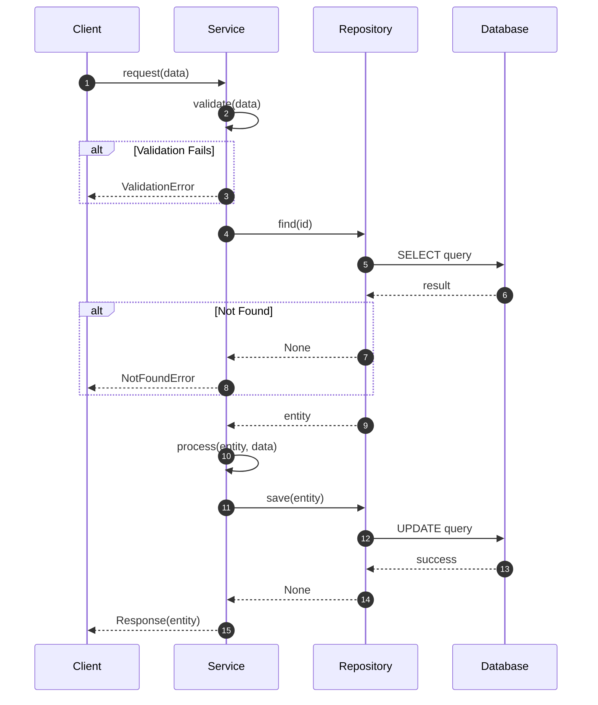

# Sequence Diagram: [Flow Name]

## Overview

Brief description of this workflow/flow.

## Preconditions

- Condition 1
- Condition 2

## Postconditions

- Result 1
- Result 2

## Diagram



## Error Handling

| Step | Error | Response |
|------|-------|----------|
| 2 | Invalid data | ValidationError |
| 5 | Entity not found | NotFoundError |
| 9 | Database failure | RepositoryError |

## Test Cases

Each numbered step should have corresponding tests:

```python
def test_request_success():
    """Steps 1-10: Full happy path"""
    ...

def test_validation_fails():
    """Step 2 alt: Invalid data returns ValidationError"""
    ...

def test_not_found():
    """Step 5 alt: Missing entity returns NotFoundError"""
    ...
```

## Complexity Notes

- Service.process() must have complexity ≤ 5
- Use guard clauses for error handling (steps 2, 5)
