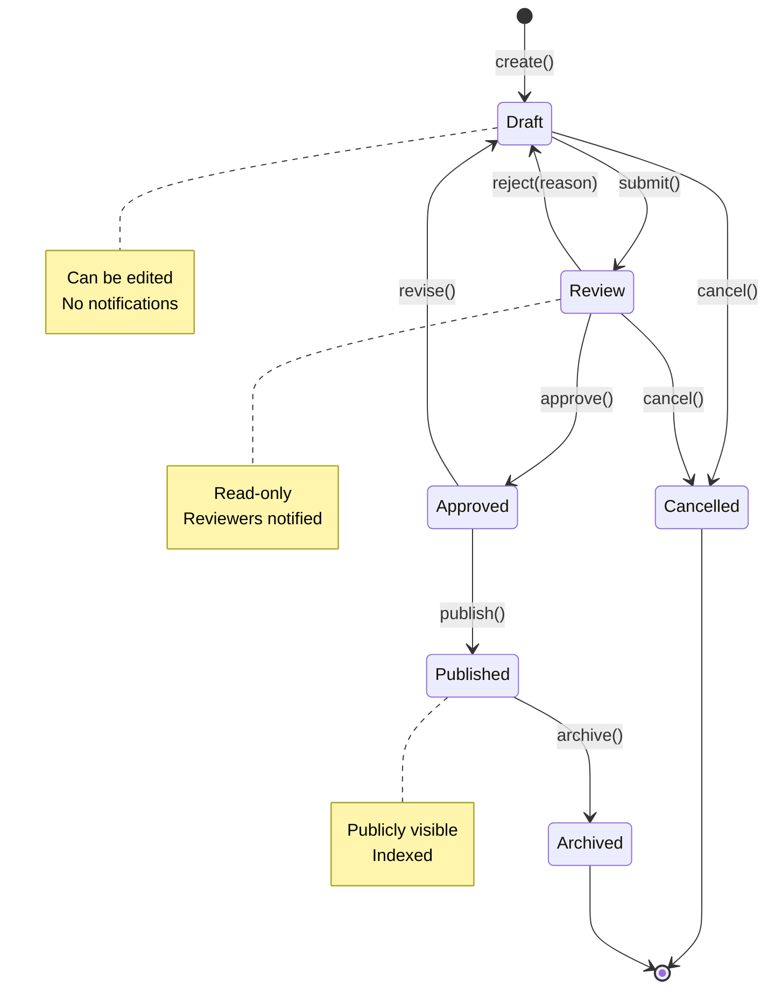

# State Diagram: [Entity Name]

## Overview

Brief description of the stateful entity and its lifecycle.

## States

| State | Description | Valid Transitions |
|-------|-------------|-------------------|
| Initial | Starting state | → State1 |
| State1 | Description | → State2, → Final |
| State2 | Description | → State1, → Final |
| Final | End state | (none) |

## Diagram



## State Pattern Implementation

```python
from typing import Protocol

class DocumentState(Protocol):
    def submit(self, doc: "Document") -> None: ...
    def approve(self, doc: "Document") -> None: ...
    def reject(self, doc: "Document", reason: str) -> None: ...
    def cancel(self, doc: "Document") -> None: ...

class Draft:
    def submit(self, doc: "Document") -> None:
        doc.state = Review()

    def approve(self, doc: "Document") -> None:
        raise InvalidTransitionError("Cannot approve draft")

    def reject(self, doc: "Document", reason: str) -> None:
        raise InvalidTransitionError("Cannot reject draft")

    def cancel(self, doc: "Document") -> None:
        doc.state = Cancelled()
```

## Test Cases

Each transition should have tests:

```python
def test_draft_to_review():
    """Draft.submit() → Review"""
    doc = Document(state=Draft())
    doc.submit()
    assert isinstance(doc.state, Review)

def test_draft_cannot_approve():
    """Draft.approve() raises InvalidTransitionError"""
    doc = Document(state=Draft())
    with pytest.raises(InvalidTransitionError):
        doc.approve()

def test_review_to_draft_on_reject():
    """Review.reject() → Draft with reason"""
    doc = Document(state=Review())
    doc.reject("Needs more detail")
    assert isinstance(doc.state, Draft)
    assert doc.rejection_reason == "Needs more detail"
```

## Invariants

- Entity always has exactly one state
- Transitions are atomic
- Invalid transitions raise `InvalidTransitionError`
- State changes are logged for audit
