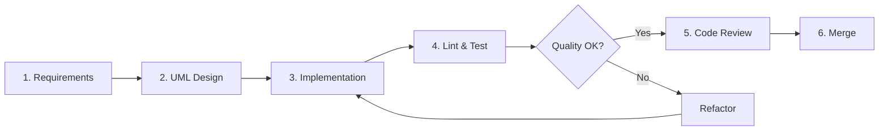

# JavaScript Coding Principles Guide

This guide establishes coding standards for JavaScript/Node.js development, enforcing clean architecture through SOLID principles, Gang of Four design patterns, and measurable code quality.

## Development Workflow

Every feature or module must follow this workflow:



## Core Principles

| Principle | Document | Purpose |
|-----------|----------|---------|
| SOLID | [01-solid-principles.md](./01-solid-principles.md) | Class design fundamentals |
| GoF Creational | [02-gang-of-four-creational.md](./02-gang-of-four-creational.md) | Object creation patterns |
| GoF Structural | [03-gang-of-four-structural.md](./03-gang-of-four-structural.md) | Object composition patterns |
| GoF Behavioral | [04-gang-of-four-behavioral.md](./04-gang-of-four-behavioral.md) | Object interaction patterns |
| Happy Path | [05-happy-path-programming.md](./05-happy-path-programming.md) | Code flow and readability |
| JSDoc | [06-jsdoc-documentation.md](./06-jsdoc-documentation.md) | Documentation standards |
| Complexity | [07-cyclomatic-complexity-eslint.md](./07-cyclomatic-complexity-eslint.md) | Measurable code quality |
| UML First | [08-uml-diagrams-before-development.md](./08-uml-diagrams-before-development.md) | Design before code |
| Full Example | [09-complete-workflow-example.md](./09-complete-workflow-example.md) | End-to-end demonstration |
| Review Checklist | [10-code-review-checklist.md](./10-code-review-checklist.md) | PR review standards |
| Anti-Patterns | [11-anti-patterns-to-avoid.md](./11-anti-patterns-to-avoid.md) | What NOT to do |

## Mandatory Requirements

### Before Writing Code
1. Create UML class diagram showing relationships
2. Create UML sequence diagram for complex flows
3. Get design approval from team lead

### During Implementation
1. Use JSDoc for public functions and complex logic
2. Maximum cyclomatic complexity: 10 per function
3. Follow SOLID principles
4. Use appropriate GoF patterns (don't force them)

### Before Merge
1. Run `npm run lint` - no ESLint errors
2. Run `npm run format:check` - code formatted
3. Run `npm test` - all tests pass
4. Run `npm run test:coverage` - >80% coverage

## Quick Reference: ESLint Complexity

| Complexity | Action |
|------------|--------|
| 1-10 | Acceptable |
| 11-20 | **Refactor required** |
| 21+ | **Reject PR** |

## Quick Reference: ES Module Imports

```javascript
// Named exports/imports
import { functionName, ClassName } from './module.js';

// Default export/import
import DefaultExport from './module.js';

// Namespace import
import * as utils from './utils.js';

// Node.js built-ins
import path from 'path';
import { readFile } from 'fs/promises';
```
