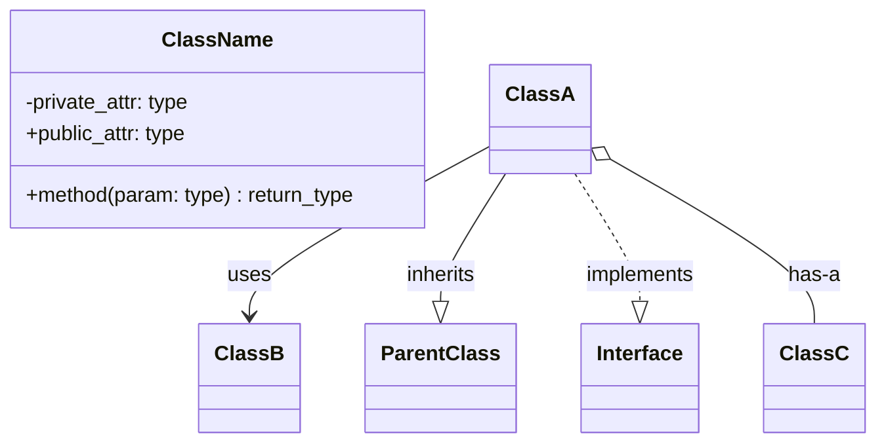
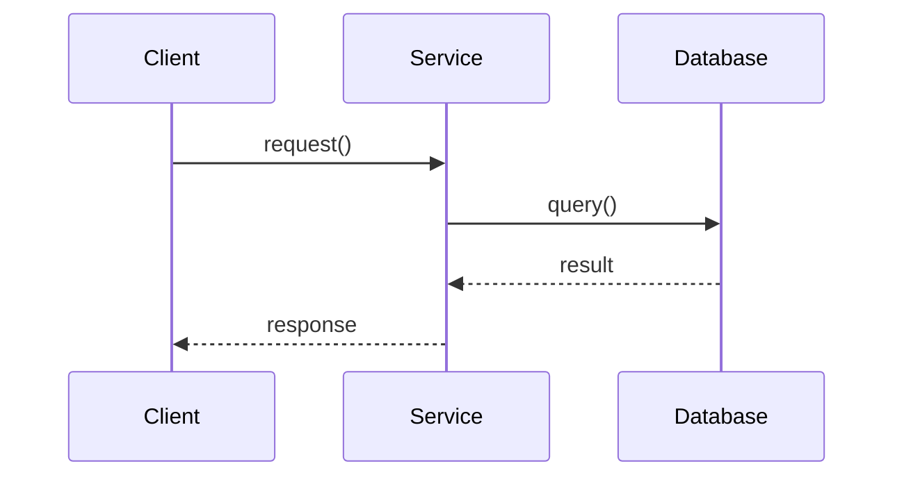
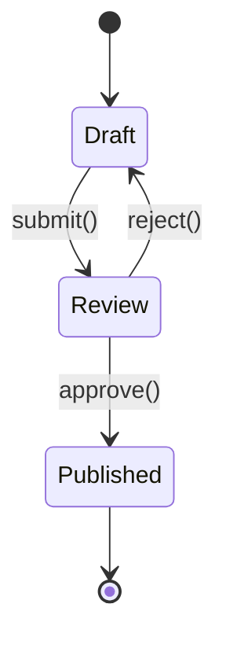

# UML Diagrams Before Development

## Rule

**No implementation without UML approval.** Create diagrams BEFORE writing code.

## Required Diagrams

| Diagram Type | When Required |
|--------------|---------------|
| Class Diagram | Any new module with 2+ classes |
| Sequence Diagram | Any flow involving 3+ components |
| State Diagram | Any entity with state transitions |

## Class Diagram Template

## Sequence Diagram Template

## State Diagram Template

## Workflow

1. Write UML in PR description or `/docs`
2. Get design approval
3. Implement matching the diagram
4. Update diagram if implementation differs

## Tools

- **Mermaid** - Renders in GitHub/GitLab markdown
- **PlantUML** - More features, needs renderer
- **draw.io** - Visual editor, export as PNG
