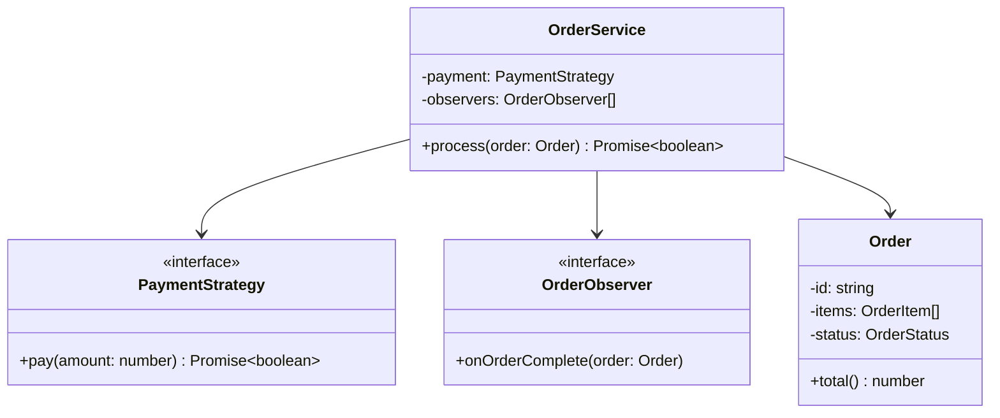

# Complete Workflow Example

## 1. Requirements

Build an order processing system that:
- Creates orders with items
- Calculates totals with discounts
- Processes payments
- Sends notifications

## 2. UML Design (BEFORE coding)



## 3. Implementation Checklist

- [ ] JSDoc on all public functions
- [ ] Guard clauses for validation
- [ ] Strategy pattern for payments
- [ ] Observer pattern for notifications
- [ ] Each class single responsibility

## 4. Quality Gates

```bash
# Run before PR
npm run lint          # No ESLint errors
npm run format:check  # Code formatted
npm test              # All tests pass
npm run test:coverage # 80%+ coverage
```

## 5. Sample Implementation

```javascript
// src/orders/types.js

/**
 * @typedef {Object} OrderItem
 * @property {string} id
 * @property {string} name
 * @property {number} price
 * @property {number} quantity
 */

/**
 * @typedef {'pending' | 'processing' | 'completed' | 'cancelled'} OrderStatus
 */

/**
 * @typedef {Object} Order
 * @property {string} id
 * @property {OrderItem[]} items
 * @property {OrderStatus} status
 */
```

```javascript
// src/orders/order-service.js

/**
 * @typedef {Object} PaymentStrategy
 * @property {(amount: number) => Promise<boolean>} pay
 */

/**
 * @typedef {Object} OrderObserver
 * @property {(orderId: string) => void} onComplete
 */

export class OrderService {
  /**
   * @param {PaymentStrategy} payment
   * @param {OrderObserver[]} observers
   */
  constructor(payment, observers = []) {
    this.payment = payment;
    this.observers = observers;
  }

  /**
   * Calculate order total.
   * @param {Order} order
   * @returns {number}
   */
  calculateTotal(order) {
    return order.items.reduce((sum, item) => sum + item.price * item.quantity, 0);
  }

  /**
   * Process an order.
   * @param {Order} order
   * @returns {Promise<boolean>}
   */
  async process(order) {
    // Guard clauses
    if (!order.items || order.items.length === 0) {
      return false;
    }

    // Calculate and charge
    const total = this.calculateTotal(order);
    const paid = await this.payment.pay(total);
    if (!paid) {
      return false;
    }

    // Notify observers
    for (const observer of this.observers) {
      observer.onComplete(order.id);
    }

    return true;
  }
}
```

```javascript
// src/orders/strategies/credit-card.js

/**
 * Credit card payment strategy.
 * @type {PaymentStrategy}
 */
export const creditCardPayment = {
  async pay(amount) {
    console.log(`Charging $${amount} to credit card`);
    // Actual payment logic here
    return true;
  },
};
```

```javascript
// src/orders/observers/email-notifier.js

/**
 * Email notification observer.
 * @type {OrderObserver}
 */
export const emailNotifier = {
  onComplete(orderId) {
    console.log(`Sending confirmation email for order ${orderId}`);
    // Actual email logic here
  },
};
```

## 6. Test File

```javascript
// tests/orders/order-service.test.js
import { describe, it, expect, vi } from 'vitest';
import { OrderService } from '../../src/orders/order-service.js';

describe('OrderService', () => {
  const mockPayment = { pay: vi.fn() };
  const mockObserver = { onComplete: vi.fn() };

  it('should process valid order', async () => {
    mockPayment.pay.mockResolvedValue(true);
    const service = new OrderService(mockPayment, [mockObserver]);

    const order = {
      id: '123',
      items: [{ id: '1', name: 'Widget', price: 10, quantity: 2 }],
      status: 'pending',
    };

    const result = await service.process(order);

    expect(result).toBe(true);
    expect(mockPayment.pay).toHaveBeenCalledWith(20);
    expect(mockObserver.onComplete).toHaveBeenCalledWith('123');
  });

  it('should reject empty orders', async () => {
    const service = new OrderService(mockPayment);
    const order = { id: '123', items: [], status: 'pending' };

    const result = await service.process(order);

    expect(result).toBe(false);
  });
});
```

## 7. Complexity Check

```bash
$ npm run lint

# Expected output: no errors
# All functions should have complexity < 10
```
