# TDD Red-Green-Blue Workflow

This document defines the Test-Driven Development workflow orchestrated by Opus 4.5, with Sonnet and Cerebras as code generation workers.

## Actors

| Actor | Role |
|-------|------|
| **User** | Initiates task request |
| **Opus (Main)** | Orchestrator, validator, quality gate enforcer |
| **sonnet-dispatcher** | Skill that dispatches to Sonnet 4.5 subagents |
| **cerebras-dispatcher** | Subagent that dispatches to Cerebras MCP |
| **Sonnet Agents** | Code generation workers (via Task tool) |
| **Cerebras Workers** | Code generation workers (via MCP tools) |

## Workflow Sequence

```mermaid
sequenceDiagram
    autonumber
    participant User
    participant Opus as Opus 4.5 (Main Context)
    participant Principles as .ai/principles/*.md
    participant Designs as .ai/designs/
    participant SonnetSkill as sonnet-dispatcher (Skill)
    participant CerebrasAgent as cerebras-dispatcher (Subagent)
    participant Sonnet as Sonnet 4.5 Agents
    participant Cerebras as Cerebras Workers

    %% ========== PLANNING PHASE ==========
    rect rgb(70, 70, 120)
        Note over User,Cerebras: PLANNING PHASE

        User->>Opus: Task Request

        Opus->>Principles: Read all principle files
        Principles-->>Opus: SOLID, GoF, Happy Path, JSDoc, ESLint, Anti-patterns

        Opus->>Opus: Analyze requirements
        Opus->>Opus: Identify SOLID principles needed
        Opus->>Opus: Select appropriate GoF patterns

        Opus->>Designs: Create class-diagram.md
        Opus->>Designs: Create sequence-diagram.md
        Opus->>Designs: Create state-diagram.md (if needed)

        Opus-->>User: Present UML designs for approval
        User-->>Opus: Approve designs
    end

    %% ========== RED PHASE (Tests First) ==========
    rect rgb(120, 50, 50)
        Note over User,Cerebras: RED PHASE - Write Failing Tests

        Opus->>Opus: Generate test specifications from UML

        alt Use Sonnet for Tests
            Opus->>SonnetSkill: Dispatch test creation
            Note right of SonnetSkill: Includes: principles + UML diagrams
            SonnetSkill->>Sonnet: Task(model: sonnet)
            Note right of Sonnet: Create tests matching UML
            Sonnet->>Sonnet: Write unit tests
            Sonnet->>Sonnet: Write integration tests
            Sonnet-->>SonnetSkill: Test files created
            SonnetSkill-->>Opus: Tests complete
        else Use Cerebras for Tests
            Opus->>CerebrasAgent: Dispatch test creation
            Note right of CerebrasAgent: Includes: principles + UML diagrams
            CerebrasAgent->>Cerebras: batch_write(tests)
            Cerebras-->>CerebrasAgent: Test files created
            CerebrasAgent-->>Opus: Tests complete
        end

        Opus->>Opus: Run tests (expect failures)
        Opus->>Opus: Validate tests match UML structure
        Opus-->>User: RED: All tests failing as expected
    end

    %% ========== GREEN PHASE (Implementation) ==========
    rect rgb(50, 120, 50)
        Note over User,Cerebras: GREEN PHASE - Make Tests Pass

        Opus->>Opus: Plan implementation order

        par Parallel Implementation
            Opus->>SonnetSkill: Dispatch implementation (subset A)
            Note right of SonnetSkill: Includes: principles + UML + test files
            SonnetSkill->>Sonnet: Task(model: sonnet) [parallel]
            Sonnet->>Sonnet: Implement classes
            Sonnet-->>SonnetSkill: Implementation A complete

            Opus->>CerebrasAgent: Dispatch implementation (subset B)
            Note right of CerebrasAgent: Includes: principles + UML + test files
            CerebrasAgent->>Cerebras: batch_write(impl) [parallel]
            Cerebras-->>CerebrasAgent: Implementation B complete
        end

        SonnetSkill-->>Opus: Sonnet work complete
        CerebrasAgent-->>Opus: Cerebras work complete

        Opus->>Opus: Run tests

        alt Tests Pass
            Opus-->>User: GREEN: All tests passing
        else Tests Fail
            Opus->>Opus: Identify failing tests
            Opus->>SonnetSkill: Fix failures
            SonnetSkill->>Sonnet: Task(fix specific failures)
            Sonnet-->>SonnetSkill: Fixes applied
            SonnetSkill-->>Opus: Fixes complete
            Opus->>Opus: Re-run tests
        end
    end

    %% ========== BLUE PHASE (Refactor) ==========
    rect rgb(50, 80, 140)
        Note over User,Cerebras: BLUE PHASE - Refactor

        Opus->>Opus: Run npm run lint (ESLint check)
        Opus->>Opus: Run npm run format:check (Prettier)
        Opus->>Opus: Validate SOLID compliance
        Opus->>Opus: Check UML adherence

        alt Quality Gates Pass
            Opus-->>User: BLUE: All quality gates passed
        else Quality Gates Fail
            Opus->>Opus: Identify violations

            par Parallel Refactoring
                Opus->>SonnetSkill: Refactor (complexity issues)
                Note right of SonnetSkill: Includes: ESLint output + principles
                SonnetSkill->>Sonnet: Task(refactor for complexity)
                Sonnet-->>SonnetSkill: Refactored

                Opus->>CerebrasAgent: Refactor (formatting issues)
                Note right of CerebrasAgent: Includes: Prettier output + principles
                CerebrasAgent->>Cerebras: batch_write(formatting fixes)
                Cerebras-->>CerebrasAgent: Formatted
            end

            Opus->>Opus: Re-run all quality gates
            Opus->>Opus: Re-run all tests
        end
    end

    %% ========== VALIDATION PHASE ==========
    rect rgb(100, 100, 50)
        Note over User,Cerebras: FINAL VALIDATION

        Opus->>Opus: Validate UML matches implementation
        Opus->>Designs: Update diagrams if needed
        Opus->>Opus: Generate coverage report
        Opus->>Opus: Final quality gate check

        Opus-->>User: Task Complete
        Note right of User: Deliverables:<br/>- .ai/designs/*.md (UML)<br/>- src/ (implementation)<br/>- tests/ (test suite)<br/>- Quality report
    end
```



## Phase Details

### Planning Phase

1. **Read Principles**: Load all files from `.ai/principles/`:
   - `00-coding-principles-index.md` - Workflow overview
   - `01-solid-principles.md` - SOLID reference
   - `02-gang-of-four-creational.md` - Creational patterns
   - `03-gang-of-four-structural.md` - Structural patterns
   - `04-gang-of-four-behavioral.md` - Behavioral patterns
   - `05-happy-path-programming.md` - Code flow
   - `06-jsdoc-documentation.md` - Documentation standards
   - `07-cyclomatic-complexity-eslint.md` - Complexity gates
   - `08-uml-diagrams-before-development.md` - UML requirements
   - `09-complete-workflow-example.md` - Full example
   - `10-code-review-checklist.md` - Review standards
   - `11-anti-patterns-to-avoid.md` - What NOT to do

2. **Create UML Designs** in `.ai/designs/`:
   - Class diagrams showing relationships
   - Sequence diagrams for workflows
   - State diagrams for stateful entities

### Red Phase (Tests First)

Dispatch context MUST include:
```
CONTEXT FOR WORKER:
1. Principles: [contents of .ai/principles/*.md]
2. UML Designs: [contents of .ai/designs/*.md]
3. Requirements: [specific test requirements]

RULES:
- Tests MUST match UML class structure
- Test names MUST reflect UML sequence flows
- Use Vitest with describe/it/expect
- Each test function should be focused and simple
```

### Green Phase (Implementation)

Dispatch context MUST include:
```
CONTEXT FOR WORKER:
1. Principles: [contents of .ai/principles/*.md]
2. UML Designs: [contents of .ai/designs/*.md]
3. Test Files: [contents of tests/*.test.js]
4. Requirements: [specific implementation requirements]

RULES:
- Implementation MUST match UML exactly
- All tests MUST pass
- JSDoc on all public functions
- Guard clauses, not nested conditionals
```

### Blue Phase (Refactor)

Dispatch context MUST include:
```
CONTEXT FOR WORKER:
1. Principles: [contents of .ai/principles/*.md]
2. UML Designs: [contents of .ai/designs/*.md]
3. Quality Gate Output:
   - npm run lint output (ESLint)
   - npm run format:check output (Prettier)
   - npm run test:coverage output (coverage)
4. Specific Violations: [list of issues to fix]

RULES:
- Refactor without changing behavior
- All tests MUST still pass
- Complexity max 10 per function
- No ESLint errors
```

## Quality Gates

| Gate | Command | Pass Criteria |
|------|---------|---------------|
| Lint | `npm run lint` | No errors |
| Format | `npm run format:check` | No issues |
| Tests | `npm test` | All pass |
| Coverage | `npm run test:coverage` | >80% coverage |

## Dispatcher Responsibilities

### Opus (Main Context)
- Orchestrates entire workflow
- Reads and interprets principles
- Creates UML designs
- Validates quality gates
- Makes final approval decisions

### sonnet-dispatcher (Skill)
- Receives context from Opus
- Spawns Sonnet agents via Task tool
- Passes principles + UML + docs to each agent
- Returns results to Opus

### cerebras-dispatcher (Subagent)
- Receives context from Opus
- Calls Cerebras MCP tools
- Passes principles + UML + docs to each worker
- Returns results to Opus
