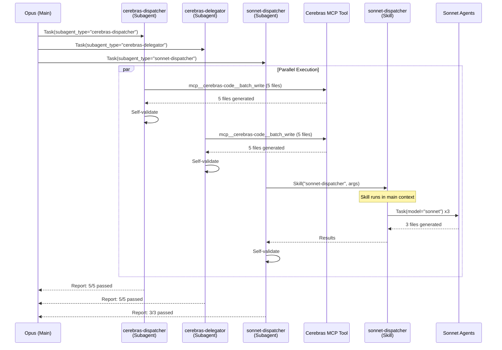
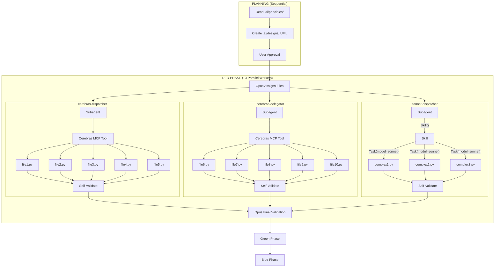

# TDD Workflow Timing Diagram

This document defines parallelism constraints and timing for the TDD workflow.

## Architecture Overview

```
                              ┌─────────────────────────────────────┐
                              │         OPUS (Main Architect)       │
                              │   - Reads principles from .ai/principles/     │
                              │   - Creates UML in .ai/designs/     │
                              │   - Assigns files to dispatchers    │
                              │   - Final validation                │
                              └──────────────┬──────────────────────┘
                                             │
                ┌────────────────────────────┼────────────────────────────┐
                │                            │                            │
                ▼                            ▼                            ▼
     ┌─────────────────────┐    ┌─────────────────────┐    ┌─────────────────────┐
     │ cerebras-dispatcher │    │ cerebras-delegator  │    │  sonnet-dispatcher  │
     │     (Subagent)      │    │     (Subagent)      │    │     (Subagent)      │
     │  + Self-validates   │    │  + Self-validates   │    │  + Self-validates   │
     └──────────┬──────────┘    └──────────┬──────────┘    └──────────┬──────────┘
                │                          │                          │
                ▼                          ▼                          ▼
     ┌─────────────────────┐    ┌─────────────────────┐    ┌─────────────────────┐
     │   Cerebras MCP      │    │   Cerebras MCP      │    │  sonnet-dispatcher  │
     │   (batch_write)     │    │   (batch_write)     │    │      (Skill)        │
     │    Max 5 files      │    │    Max 5 files      │    │  runs in main ctx   │
     └──────────┬──────────┘    └──────────┬──────────┘    └──────────┬──────────┘
                │                          │                          │
          ┌─────┼─────┐              ┌─────┼─────┐              ┌─────┼─────┐
          ▼  ▼  ▼  ▼  ▼              ▼  ▼  ▼  ▼  ▼              ▼     ▼     ▼
         C1 C2 C3 C4 C5             C6 C7 C8 C9 C10            S1    S2    S3
         (Cerebras API)             (Cerebras API)          (Sonnet Subagents)
```

## Key Architecture Constraint

**Subagents CANNOT dispatch other subagents.** This affects how each dispatcher works:

| Dispatcher | How It Dispatches | Why |
|------------|-------------------|-----|
| cerebras-dispatcher | MCP Tool (`mcp__cerebras-code__batch_write`) | MCP tools are not subagents |
| cerebras-delegator | MCP Tool (`mcp__cerebras-code__batch_write`) | MCP tools are not subagents |
| sonnet-dispatcher | Skill → Task(model="sonnet") | Skills run in main context, CAN dispatch subagents |

## Parallelism Summary

| Dispatcher | Type | Dispatch Method | Max Workers | Validates |
|------------|------|-----------------|-------------|-----------|
| `cerebras-dispatcher` | Subagent | MCP Tool | 5 Cerebras | Yes |
| `cerebras-delegator` | Subagent | MCP Tool | 5 Cerebras | Yes |
| `sonnet-dispatcher` | Subagent | Skill → Task | 3 Sonnet | Yes |
| **TOTAL** | | | **13 workers** | |

## Dispatch Order

**Always dispatch Cerebras before Sonnet** - Cerebras is faster, so start it first:

```python
# In ONE message, dispatch all 3 in this order:
Task(subagent_type="cerebras-dispatcher", ...)  # Uses MCP tool → 5 Cerebras
Task(subagent_type="cerebras-delegator", ...)   # Uses MCP tool → 5 Cerebras
Task(subagent_type="sonnet-dispatcher", ...)    # Uses Skill → 3 Sonnet agents
```

## Detailed Dispatch Flow



## Timing Diagram (Gantt)

```mermaid
gantt
    title TDD Workflow - 13 Parallel Workers
    dateFormat X
    axisFormat %s

    section Planning (Sequential)
    Read .ai/principles/           :p1, 0, 2
    Analyze requirements            :p2, after p1, 2
    Create UML diagrams             :p3, after p2, 4
    User approves designs           :milestone, p4, after p3, 0

    section Red Phase (13 Parallel)
    Opus assigns files              :r0, after p4, 1
    cerebras-dispatcher (5 tests)   :r1, after r0, 5
    cerebras-delegator (5 tests)    :r2, after r0, 5
    sonnet-dispatcher (3 tests)     :r3, after r0, 6
    Dispatchers self-validate       :r4, after r1 r2 r3, 2
    Opus final validation           :r5, after r4, 1
    Run tests (expect fail)         :r6, after r5, 1

    section Green Phase (13 Parallel)
    Opus assigns impl files         :g0, after r6, 1
    cerebras-dispatcher (5 impl)    :g1, after g0, 6
    cerebras-delegator (5 impl)     :g2, after g0, 6
    sonnet-dispatcher (3 impl)      :g3, after g0, 7
    Dispatchers self-validate       :g4, after g1 g2 g3, 2
    Opus final validation           :g5, after g4, 1
    Run tests (must pass)           :g6, after g5, 2

    section Blue Phase (13 Parallel)
    Run quality gates               :b0, after g6, 2
    Opus assigns refactors          :b1, after b0, 1
    cerebras-dispatcher (refactor)  :b2, after b1, 4
    cerebras-delegator (refactor)   :b3, after b1, 4
    sonnet-dispatcher (refactor)    :b4, after b1, 5
    Dispatchers self-validate       :b5, after b2 b3 b4, 2
    Final quality gates             :b6, after b5, 2
```



## Parallel Dispatch Flow



## File Assignment Strategy

Main Opus assigns files based on complexity:

| Complexity | Assigned To | Reasoning |
|------------|-------------|-----------|
| Low (CRUD, boilerplate) | cerebras-dispatcher | Fast + reliable |
| Medium (services, repos) | cerebras-delegator | Fast + reliable |
| High (algorithms, patterns) | sonnet-dispatcher | Better reasoning |

### Example Assignment (13 files)

```
Task: Create user management module

cerebras-dispatcher (5 simple files via MCP):
  - user_model.py         (Data class)
  - user_repository.py    (CRUD)
  - user_validator.py     (Validation)
  - user_dto.py           (Data transfer)
  - user_errors.py        (Exceptions)

cerebras-delegator (5 simple files via MCP):
  - test_user_model.py
  - test_user_repository.py
  - test_user_validator.py
  - test_user_dto.py
  - test_user_errors.py

sonnet-dispatcher (3 complex files via Skill → Sonnet):
  - user_service.py       (Strategy pattern, complex logic)
  - auth_handler.py       (Security-critical)
  - permission_engine.py  (Complex rules)
```

## Quality Control Distribution

| Level | Who | What |
|-------|-----|------|
| L1: Worker | Cerebras MCP / Sonnet Agents | Generate code |
| L2: Dispatcher | Each dispatcher subagent | Self-validate output |
| L3: Architect | Opus (Main) | Final validation + quality gates |

**Distributed QC Benefits:**
- Each dispatcher validates its own subset (3-5 files)
- Opus only reviews 3 dispatcher reports, not 13 files
- Failures caught early at L2, fixed before L3

## Constraints

| Constraint | Value | Reason |
|------------|-------|--------|
| Cerebras per dispatcher | Max 5 | Rate limits |
| Sonnet agents | Max 3 | Cost + context duplication |
| Total parallel | Max 13 | 5 + 5 + 3 |
| Phases | Sequential | Tests before impl |
| Subagent dispatch | NOT ALLOWED | Use MCP tools or Skills instead |

## Summary

**Maximum Parallelism: 13 workers**
- 5 + 5 = 10 Cerebras workers (via MCP tool, fast)
- 3 Sonnet agents (via Skill → Task, slower but smarter)

**Dispatch Methods:**
- Cerebras dispatchers → MCP Tool (`mcp__cerebras-code__batch_write`)
- Sonnet dispatcher → Skill (`sonnet-dispatcher`) → Task(model="sonnet")

**Dispatch Order: Cerebras first, Sonnet last**
- Cerebras workers are faster
- Start them first to maximize parallelism

**Quality Control: 3 layers**
- Workers generate
- Dispatchers self-validate
- Opus final validation

**Bottlenecks:**
- Planning phase (sequential)
- Phase transitions (must complete before next)
- Failed validations (require retry)
